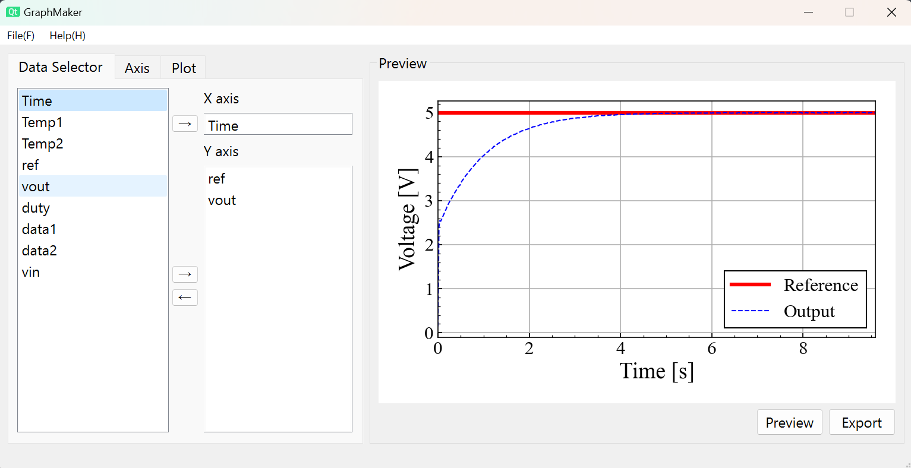

# 概要
csvファイルからグラフを作成するプログラムです。

※ 起動に結構時間がかかります

<!-- 画像の挿入 -->

# 導入
右側の [releases](https://github.com/Ama-suke/GraphMaker/releases) から exeファイルをダウンロード

※ windows 以外では動作しません

# 使い方
- Files → Load table からデータを読み込む

    csvのデータは以下のように先頭にヘッダをつけてください。
    | Header1 | Header2 | Header3 |
    |---------|---------|---------|
    | 23      | 56      | 0.0078  |
    | 45      | 89      | 0.0012  |
    | 67      | 34      | -0.0090 |

- Data Selector タブでデータを選択する

    左のリストからデータを選択して矢印ボタンで選択できます。
    リストのダブルクリックでも可能です。

- プロットのオプションを設定する

    Axis, Plot のタブからオプションを設定します。
    設定できる項目は次の章をご覧ください。
    
    ※ プレビューが更新されない場合は右下の Preview ボタンを押してください

- プロットを保存する

    右下の Export ボタンからプロットを保存できます。
    png, pdf に対応しています。

# オプションの種類
- Axisタブ

    | ラベル | 説明 |
    |--|--|
    | Label     | 各軸のラベルのテキスト   |
    | Font size | 各軸のラベルの文字サイズ |
    | Min limit | 表示範囲の制限. 最小値 |
    | Max limit | 表示範囲の制限. 最大値 |

- Plotタブ
    - Line
        
    | ラベル | 説明 |
    |--|--|
    | Width | 線の太さ. データごとに設定    |
    | Color | 線の色. データごとに設定      |
    | Stile | 線のスタイル. データごとに設定 |

    - Legend

    | ラベル | 説明 |
    |--|--|
    | Text      | 凡例のテキスト. データごとに設定. チェックボックスで有効化 |
    | Font size | 凡例のフォントサイズ |
    | Position  | 凡例の位置 |

    - Axes

    | ラベル | 説明 |
    |--|--|
    | Grid | グリッドの有効化 |
        
# オプションの保存

よく使う設定は json として保存できます。
- File → Save setting で現在のプロットオプションを保存
- File → Load setting でファイルからプロットオプションを読み込み

# 開発者へ
- .uiファイルは現状使っていません。参考程度に見てください
    - 修正は ui_form.py に直でお願いします。
- インストーラは PyInstaller、Nuitka があります。Nuitka のほうが完成した exe が軽量です。

## 必要なパッケージ
- Python 3.11.x
    - PySide 6.6.3
    - matplotlib

# Coming Soon
- rosbag ファイルへの対応
- 各プロットに個別に x軸を割り当てる
- 簡単な算術演算機能の実装

<!-- 気づいたことがあれば追記してください -->
# Tips
- 設定を変更するときはデータを消した状態で実行するとスムーズにできます。